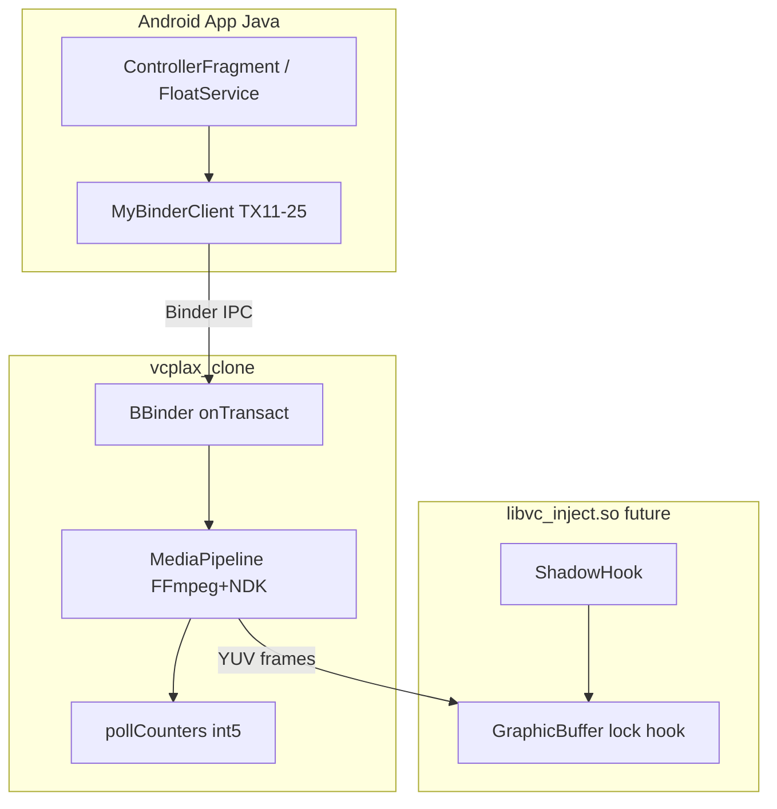

# Clone roadmap — closing the last ~10% and building without original libvc

Date: 2026-06-27  
Status: Binder protocol **~99.5%** decoded; RE Tool v1.1 auto-capture **validated** (`re_tool_capture_cf7e.log`).

---

## Executive summary

| Gap | Tool / artifact | Done? |
|---|---|:---:|
| XOR symbol names in libvc | static Ghidra XOR decode OR true spawn | **Still open** |
| TX13 int[5] semantics | TX13 delta logger | **✅ c0=active, c1/c2=WxH** |
| Runtime capture (no Termux) | RE Tool v1.1 START | **✅ validated** |
| TX11/TX14 native pipeline | Ghidra + cf7e live | ~88% |
| Runnable Binder stub | `clone/native/libvc_clone.cpp` | Skeleton |

---

## Phase 0 — Prerequisites (phone, Termux, root)

```bash
pkg install root-repo frida frida-python
setenforce 0
cp tools/termux/frida_hook_libvc.js /data/local/tmp/
cp tools/termux/frida_spawn_vcplax.sh /data/local/tmp/
chmod +x /data/local/tmp/frida_spawn_vcplax.sh
```

---

## Phase 1 — XOR symbol deobfuscation (libvc hooks)

### Problem

`libvc.so` stores hook target library + symbol names XOR-obfuscated in `.rodata`.  
`shadowhook_hook_sym_name(lib, sym, …)` receives **already decoded** strings, but if Frida attaches **after** `dlopen`, hooks are installed and `[HOOK_SYM]` never appears.

### Solution A — spawn vcplax (recommended)

```bash
tsu -c '/data/local/tmp/frida_spawn_vcplax.sh'
# or manually:
tsu -c 'killall vcplax; /data/local/tmp/frida-inject -f /data/vcplax \
  --runtime=qjs -s /data/local/tmp/frida_hook_libvc.js --no-pause -- \
  /data/vcplax vlive 2>&1 | tee /data/local/tmp/libvc_symbols.log'
```

Expected log lines:

```text
[dlopen] /data/libvc++.so => 0x...
[shadowhook_init] mode=1 debug=0
[libvc init] enter ctx=0x...
[XOR_STATIC] lib_name key@+8 => "libui.so"
[XOR_STATIC] sym_1 key@+7d => "_ZN7android13GraphicBuffer..."
[HOOK_SYM] lib="libui.so" sym="_ZN7android13GraphicBuffer4lockEjPPvPiS3_"
```

### Solution B — attach to running vcplax (late)

```bash
PID=$(pidof vcplax)
/data/local/tmp/frida-inject -p "$PID" \
  -s /data/local/tmp/frida_hook_libvc.js --runtime=qjs \
  2>&1 | tee /data/local/tmp/binder_sniff.log
```

Works for **Binder + TX13**, but XOR static decode needs the **runtime key bytes** from `libvc` init context — script prints a warning and attempts best-effort decode with key=0.

### XOR algorithm (from Ghidra @ libvc `0x774b0`)

```cpp
// Per-string key byte from hook-state struct (ctx+0x08, ctx+0x7d, …)
std::string decode_xor(const uint8_t* blob, size_t len, uint8_t keyByte) {
    std::string out(len, '\0');
    uint8_t seed = 7;
    for (size_t i = 0; i < len; ++i) {
        uint8_t b = seed ^ blob[i];
        seed = uint8_t(seed + 0x1f);
        out[i] = char((int(i) + b - 0x11) ^ (keyByte + i));
    }
    return out;
}
```

Blob offsets (file VA arm64): `0x14ae86` (lib, 0x13), `0x14ae99` (sym1, 0x9f), `0x14af38`, `0x14afd5`, `0x14b06e`, `0x14b0a2`.

### Frida hooks installed

| Hook | Purpose |
|---|---|
| `dlopen` / `android_dlopen_ext` | Catch libvc load, install init hook |
| `dlsym` | Log `init` resolution |
| `libvc.so+0x774b0` | Dump decoded strings at init |
| `shadowhook_hook_sym_name` | **Ground truth** decoded lib+sym at install time |

---

## Phase 2 — TX13 poll counters

### Java consumer

```java
// App.java — every 1s
int[] state = VliveBridge.service().pollState();
```

### Native handler (Ghidra @ vcplax `0x440324`)

Writes `writeNoException()` + **int32[5]** into reply. Globals synced from pipeline:

- `DAT_00c79bf8` / `DAT_00c79c00`
- `DAT_00c79bfc` / `DAT_00c79c04`
- fifth slot (index 4) — network/queue (confirm via capture)

### Sniffer behaviour (v3)

- **No** full `[TX_START]` blocks for TX13 (no spam).
- On each TX13 **onLeave**: parse reply parcel → extract 5× int32.
- Log **`[POLL_STATE]`** only when any counter changes.

Example:

```text
[POLL_STATE] seq=42 counters=[c0=120(0x78) c1=3599(0xe0f) ...] DELTA {c1:3400->3599}
```

### Capture protocol

1. Spawn/attach sniffer v3.
2. Play local MP4 30s → note c0/c1 drift (frames).
3. Switch RTMP → note c4 jump (network).
4. Stop/play → c0 reset.
5. Map labels in `MediaContext::pollCounters[]` in clone.

---

## Phase 3 — Native pipeline TX11 / TX14

### Stack (confirmed static + Ghidra)

```text
┌─────────────────────────────────────────────────────────────┐
│ vcplax.so                                                    │
│  BBinder::onTransact                                         │
│    TX14 setMode  → flush + FUN_00541108(ctx, path)           │
│    TX11 play     → alloc 0x14c session + start decode thread │
│                                                              │
│  Demux: FFmpeg libavformat (statically linked in vcplax)     │
│    • MP4/local → avformat_open_input(file)                   │
│    • RTMP      → avio + rtmp:// + ffrtmpcrypt strings        │
│                                                              │
│  Decode/encode: AMediaCodec NDK                              │
│    AMediaCodec_createDecoderByType / _dequeueInputBuffer     │
│                                                              │
│  Inject: libvc.so (ShadowHook on libui GraphicBuffer::lock)  │
└─────────────────────────────────────────────────────────────┘
```

**Not Stagefright MediaPlayer API** — custom FFmpeg + NDK MediaCodec path inside vcplax.

### TX14 handler pseudocode (file VA `0x4403d4`)

```cpp
status_t MyBinderService::tx14_set_mode(const Parcel& in, Parcel* out) {
    int32_t mode = in.readInt32();
    String16 path16; in.readString16(&path16);
    String8 path(path16);

    service_->mode = mode;                    // BBinder+0x18
    assign_string(service_->path, path);    // BBinder+0x20

    MediaContext* ctx = service_->mediaCtx;   // BBinder+0x38
    flush_buffers(ctx);                       // mutex + codec drain
    stop_decoder_thread(ctx);

    start_pipeline(ctx, path.c_str());        // FUN_00541108
    maybe_restart_decode_thread(ctx);         // if hooks ready

    out->writeNoException();
    out->writeInt32(4);                       // OK_SET_MODE
    return NO_ERROR;
}

void start_pipeline(MediaContext* ctx, const char* uri) {
    if (ctx->mode == 1) {
        avformat_open_input(&ctx->fmt, uri, nullptr, nullptr);
        avformat_find_stream_info(ctx->fmt, nullptr);
        open_mediacodec_decoder(ctx, "video/avc");
    } else if (ctx->mode == 2) {
        AVDictionary* opts = nullptr;
        av_dict_set(&opts, "rtmp_live", "live", 0);
        avformat_open_input(&ctx->fmt, uri, nullptr, &opts);
        open_mediacodec_decoder(ctx, "video/avc");
    }
    pthread_create(&ctx->decodeThread, nullptr, decode_loop, ctx);
}
```

### TX11 handler pseudocode (file VA `0x43fedc`)

```cpp
status_t MyBinderService::tx11_play_source(const Parcel& in, Parcel* out) {
    String16 path16; in.readString16(&path16);
    int32_t mirrorIgnored = in.readInt32();   // always 0 in Java client
    int32_t loop = in.readInt32();

    if (!libvc_ready()) {
        out->writeNoException();
        out->writeInt32(0);                   // fail fast
        return NO_ERROR;
    }

    Session* sess = new Session(0x14c);
    copy_service_name(sess, binder_->serviceName);
    bind_libvc_callbacks(sess, global_hook_table);

    String8 path(path16);
    sess->loop = loop;
    enqueue_play_task(sess, path.c_str());    // FUN_00541108 family

    out->writeNoException();
    out->writeInt32(1);                       // OK_PLAY
    return NO_ERROR;
}
```

### Typical UI sequences (from live capture)

```text
Channel local:  TX14(mode=1, path) → TX11(path, 0, loop)
Channel RTMP:   TX14(mode=2, url)  → TX12 → TX11(url, 0, loop)
After transform: TX24(floats) — does not restart demux unless app replays TX14/TX11
```

---

## Phase 4 — Clone skeleton (`clone/`)

### Layout

```text
clone/
  CMakeLists.txt
  include/MediaContext.h      — shared state + TX13 counters
  native/libvc_clone.cpp      — BBinder onTransact all 11 UI codes
```

### Build (NDK cross-compile)

```bash
export NDK=$HOME/android-ndk-r26c
cmake -B clone/build -S clone \
  -DCMAKE_TOOLCHAIN_FILE=$NDK/build/cmake/android.toolchain.cmake \
  -DANDROID_ABI=arm64-v8a -DANDROID_PLATFORM=android-33
cmake --build clone/build
# deploy: adb push clone/build/vcplax_clone /data/vcplax_clone
```

### What's implemented vs TODO

| Component | Skeleton | Production TODO |
|---|---|---|
| onTransact 11–25 | ✅ | parity test vs original |
| Parcel read/write | ✅ | — |
| FFmpeg demux | stub log | link static ffmpeg like vcplax |
| AMediaCodec | stub log | decoder + inject surface |
| libvc inject | **not in clone** | separate `libvc_inject.so` + ShadowHook |
| TX13 counters | placeholder ints | wire from decode thread |

### Architecture target



---

## Phase 5 — Verification checklist

- [ ] `grep HOOK_SYM libvc_symbols.log` — ≥5 GraphicBuffer / lock symbols
- [ ] `[POLL_STATE]` deltas during play / stop / RTMP switch
- [ ] `parse_binder_sniff.py binder_sniff.log` — payloads match Java client
- [ ] `vcplax_clone` registers on ServiceManager, original app connects
- [ ] TX14→TX11 local MP4 plays (clone stub returns OK, then real demux)
- [ ] TX24 transform params applied without JPEG replay (long-term)

---

## RE progress after this phase

| Layer | Target % |
|---|--:|
| Binder IPC | 98 → **100** (after TX13 labels) |
| vcplax media pipeline | 85 → **92** |
| libvc hook targets | 55 → **80** (after HOOK_SYM capture) |
| End-to-end clone | 75 → **85** (after vcplax_clone + demux stub) |

---

## Quick command reference

```bash
# Symbols (spawn)
tsu -c '/data/local/tmp/frida_spawn_vcplax.sh'

# Binder + TX13 delta (attach)
PID=$(pidof vcplax)
/data/local/tmp/frida-inject -p "$PID" -s /data/local/tmp/frida_hook_libvc.js --runtime=qjs

# Parse capture
python3 tools/parse_binder_sniff.py /data/local/tmp/binder_sniff.log
```
