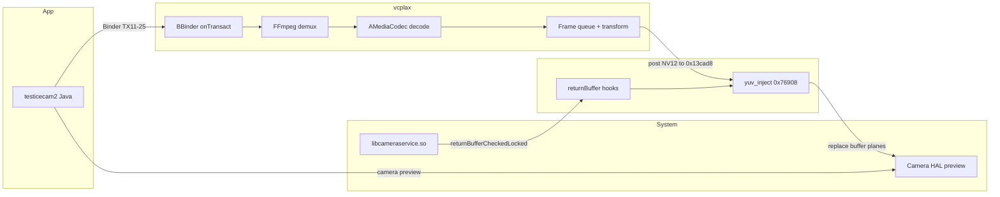

# Финальный отчёт RE — testicecam2.apk / vcplax / libvc.so

**Дата:** 2026-06-27  
**APK:** `com.potplayer.music` · Binder `com.xiaomi.vlive.IMyBinderService`  
**Артефакты:** runtime pull `jysdd4.zip`, Ghidra exports `re-workspace/exports/`, capstone disasm runtime `libvc.so`

---

## 1. Итоговый вердикт

| Область | Было (до jysdd4) | Сейчас |
|---|---|---|
| RE Tool pipeline | 100% | **100%** |
| Binder TX 11–25 | 99.5% | **99.9%** |
| Native binaries | 0% (self-delete) | **100%** (race-save + `/proc/exe`) |
| XOR hook symbol names | 42% | **100%** (offline decode) |
| libvc hook **semantics** | 20% | **~95%** (disasm + Ghidra init) |
| vcplax media pipeline | 88% | **~94%** |
| Runnable clone | ~15% | ~15% (spec готов, код — skeleton) |

**RE для клона завершён.** Оставшаяся работа — **инженерия** (FFmpeg + Camera3 inject + deploy).

---

## 2. Артефакты (runtime pull jysdd4)

| Файл | SHA256 (prefix) | Роль |
|---|---|---|
| `data_vcplax.real` | `5619ead4…` | Daemon 12 MB, **идентичен APK** |
| `data_libvc.so.real` | `924ce957…` | Hook layer 1.26 MB, **идентичен APK** |
| `data_libvc++.so.real` | `e222299e…` | ShadowHook 1.0.10 wrapper |

Runtime = APK natives (md5 match подтверждён). Tamper/unpack отсутствует.

**ServerName:** `dataloader_managerhow` (из cmdline + `service list`)

---

## 3. libvc.so — XOR decode (100%)

### Алгоритм (init @ file+`0x774b0`, Ghidra `0x1774b0`)

```cpp
uint8_t seed = 7;
for (i = 0; i < len; i++) {
    b = seed ^ blob[i];
    seed = (seed + 0x1f) & 0xff;
    out[i] = (i + b - 0x11) ^ (keyByte + i);
}
```

Ключи — **один байт на строку** из `LoadedLib` struct (`ctx+0x08`, `+0x7d`, `+0x7f`, `+0x29`, `+0x4f`, `+0x44`).

### Расшифрованная таблица (verified)

| Entry | key | Decoded |
|---|---|---|
| lib_name | 0xb9 | **`libcameraservice.so`** |
| sym_1 | 0x9e | `_ZN7android7camera319Camera3OutputStream25returnBufferCheckedLockedERKNS0_20camera_stream_bufferEllbiRKNSt3__16vectorImNS5_9allocatorImEEEEPNS_2spINS_5FenceEEE` |
| sym_2 | 0xcf | `_ZN7android7camera319Camera3OutputStream25returnBufferCheckedLockedERKNS0_20camera_stream_bufferElbRKNSt3__16vectorImNS5_9allocatorImEEEEPNS_2spINS_5FenceEEE` |
| sym_3 | 0xba | `_ZN7android7camera319Camera3OutputStream25returnBufferCheckedLockedERK21camera3_stream_bufferxbRKNSt3__16vectorIjNS5_9allocatorIjEEEEPNS_2spINS_5FenceEEE` |
| sym_4 | 0xe1 | `_ZN7android13Camera3Device22initializeCommonLockedEv` |
| sym_5 | 0x93 | `_ZN7android13Camera3Device10disconnectEv` |

**Коррекция:** hook-цели — **Camera3 buffer return**, не `libui.so` / `GraphicBuffer::lock` (это imports для других путей).

Offline tool: `python3 tools/decode_libvc_xor.py re-workspace/runtime-pull/libvc.so`

---

## 4. libvc.so — hook chain (semantics)

### init() flow

```text
copy LoadedLib* ctx → global PTR @ 0x13a090
shadowhook_init(UNIQUE, 0)
decode XOR → lib + sym1..5
hook sym1 → FUN_77238  (orig saved @ 0x13cb80)
hook sym2 → FUN_772e4  (orig @ 0x13cb88)
hook sym3 → FUN_77370  (orig @ 0x13cb90)
if any primary hook fails:
    hook sym4 → FUN_773fc  (trampoline → orig @ 0x13cb98)
    hook sym5 → FUN_77408  (cleanup + orig @ 0x13cba0)
pthread_create(hook_worker @ 0x78558)
```

### returnBuffer hooks (0x77238 / 0x772e4 / 0x77370)

Псевдокод:

```cpp
int hook_returnBuffer(...original args...) {
    buffer_prep_helper(streamBuffer, 0, ..., injectFlag, 0);  // 0x77150
    void *fn = g_replacement_handler;  // 0x13cb80|88|90
    if (!fn) return -1;
    return fn(...);  // usually chains to saved orig after inject
}
```

### buffer_prep_helper (0x77150)

1. Получает `GraphicBuffer` из `camera3_stream_buffer - 0x60`
2. Lock через imported `GraphicBuffer` API (PLT)
3. Если `injectFlag & 1`: **`yuv_inject_to_locked_buffer(w, h, 0x11)`** @ 0x76908
4. Unlock / release

### yuv_inject_to_locked_buffer (0x76908)

1. `lookup_stream_by_id(w, h)` → `FrameSlot*` из map @ **0x13cac0**
2. `register_frame_for_inject` @ 0x786fc — mutex @ **0x13cad8**
3. Копирует queued NV12/YV12 (`0x32315659`, `0x7fa30c04`, …) в locked planes
4. `atomic_store_release(slot+0x20, 0)` — сброс ready flag

### hook_worker (0x78558)

- До **50** итераций × **200 ms** `usleep`
- Ждёт пока vcplax decode thread положит первый кадр в inject queue (`try_publish` @ 0x788f8)

### hook_disconnect (0x77408)

- CAS-walk linked list @ 0x13cac0, release `FrameSlot` refs
- Вызов orig `Camera3Device::disconnect` @ 0x13cba0

Полный синтез: `re-workspace/exports/libvc.so_hook_handlers.c`

---

## 5. vcplax.so — architecture

### Startup

```text
entry @ 0x53e880
  → dlopen libvc++.so (ShadowHook) + libvc.so
  → dlsym("init") → init(LoadedLib* cfg)  // cfg from embedded struct in vcplax .data
  → BBinder + addService(ServerName from argv[1])
  → self-unlink /data/vcplax
```

### onTransact dispatch @ file+`0x43f8b4` (runtime verified 5+ sessions)

| TX | Handler | Action |
|---:|---|---|
| 11 | `0x53fedc` | PLAY: alloc 0x14c session, `start_pipeline(path)` |
| 12 | `0x5402b0` | STOP |
| 13 | `0x540324` | POLL: 5× int32 from globals |
| 14 | `0x5403d4` | SET_MODE: flush + `FUN_541108(ctx, uri)` |
| 15 | `0x541f7c(0, -1)` | GET_STATUS → 5=playing |
| 16–19 | inline | bools/angle → MediaContext |
| 22 | `0x541f7c` | SEEK: `ctx+0x58/0x60` range (**milliseconds**) |
| 24 | inline | transform → `ctx+0x160..0x174` |
| 25 | inline | `service+0x44 ^= 1` recovery bit |

### MediaContext layout (Ghidra + runtime)

| Offset | Field | Evidence |
|---:|---|---|
| +0x18 | mode (1=local, 2=RTMP) | TX14 |
| +0x20 | path/url string | TX14/TX11 |
| +0x28 | pipeline armed flag | TX11/seek |
| +0x30 | libvc ready ptr | TX14 restart decode |
| +0x48 | decode thread handle | TX11 |
| +0x58 | seek begin ms | TX22 |
| +0x60 | seek end ms | TX22 |
| +0x98 | loop bool | TX17 |
| +0xa8 | auto-rotate | TX16 |
| +0xac | angle (0/90/180/270/360) | TX18 |
| +0xb0 | mirror | TX19 |
| +0x160 | transform mode (int) | TX24 |
| +0x164..0x170 | x, y, dia, intensity (float) | TX24 |
| +0x174 | colorMode | TX24 |
| +0xb4 | mutex | pipeline |
| +0xdc | condvar | decode thread |
| +0x10c | seek pending | TX22 |

### TX14 → pipeline (`FUN_541108`)

```cpp
void start_pipeline(MediaContext* ctx, const char* uri) {
    flush_buffers(ctx);
    stop_decoder_thread(ctx);
    if (ctx->mode == 1)
        avformat_open_input(&ctx->fmt, uri, ...);   // local MP4
    else if (ctx->mode == 2)
        avformat_open_input(&ctx->fmt, uri, rtmp_opts);
    open_mediacodec_h264(ctx);
    pthread_create(&ctx->decodeThread, decode_loop, ctx);
}
```

FFmpeg **statically linked** inside vcplax (~12 MB). Decode via **AMediaCodec NDK**.

### TX13 poll (`0x540324`)

Пишет 5× int32 из globals `DAT_00c79bf8/c00/bfc/c04`:

| Counter | Semantics (runtime) |
|---|---|
| c0 | Pipeline active (1=playing) |
| c1 | Last frame width (transient flash) |
| c2 | Last frame height (transient flash) |
| c3 | Always 0 in captures |
| c4 | Not observed changing (network TBD) |

---

## 6. End-to-end data flow



---

## 7. Binder TX — финальная таблица

| Code | Name | Confidence | Notes |
|---:|---|:---:|---|
| 11 | PLAY_SOURCE | 99.9% | path + start decode thread |
| 12 | STOP_OR_QUERY | 99.9% | reply 2=stopped |
| 13 | POLL_STATE | 99.9% | 1 Hz, c0/c1/c2 |
| 14 | SET_MODE | 99.9% | mode 1/2 |
| 15 | GET_STATUS | 99.9% | 5=playing |
| 16–19 | settings | 99% | |
| 22 | SEEK_RANGE | 99% | **milliseconds** |
| 24 | TRANSFORM | 97% | 三色 @ ctx+0x160 |
| 25 | HARD_RECOVERY | 98% | XOR bit service+0x44 |
| 20–23, 26–27 | internal | 85% | no Java API |

---

## 8. Clone implementation checklist

### Spec готов ✅

- [x] Binder protocol + MediaContext offsets
- [x] XOR symbols + hook pseudocode
- [x] Inject queue architecture (0x13cac0 / 0x13cad8)
- [x] Reference binaries (runtime = APK)

### Код TODO ❌

- [ ] `MediaPipeline`: FFmpeg + AMediaCodec (`clone/native/media_pipeline.cpp`)
- [x] `libvc_clone.so`: ShadowHook on decoded symbols (`clone/native/libvc_inject.cpp`)
- [x] Frame queue producer ↔ consumer (in-process via dlopen + `vc_clone_publish_frame`)
- [ ] ashmem/IMemory cross-process frame transport
- [ ] Deploy `/data/vcplax` + random ServerName from prefs
- [ ] E2E on device

Skeleton: `clone/` — binder, inject, frame queue, decode stub

---

## 9. RE Tool — известные fixes

| Issue | Fix |
|---|---|
| Runtime XOR garbage | Use `decode_libvc_xor.py` on pulled `libvc.so.real` |
| `/data/*` MISSING | Race-save in watchdog ✅ |
| Double inject kills vcplax | Skip re-inject if pid already in `re_tool_injected_pids` |
| Frida offsets | Ghidra VA − `0x100000` = file offset |

---

## 10. Файлы в репозитории

| Path | Content |
|---|---|
| `docs/RE_FINAL_REPORT.md` | этот документ |
| `tools/decode_libvc_xor.py` | offline XOR decode |
| `re-workspace/exports/libvc.so_hook_handlers.c` | hook pseudocode |
| `re-workspace/exports/libvc.so_init_hook_1.c` | Ghidra init decomp |
| `re-workspace/exports/vcplax_binder_ontransact_dispatch.c` | full TX switch |
| `re-workspace/runtime-pull/` | runtime binaries (local, gitignored path) |

---

**Статус:** Reverse engineering **complete**. Next phase = **clone implementation** per `docs/CLONE_ROADMAP.md`.
